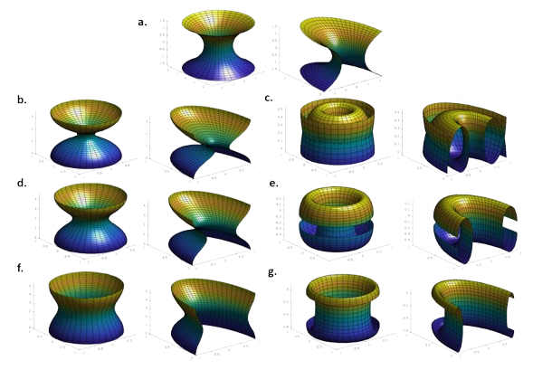
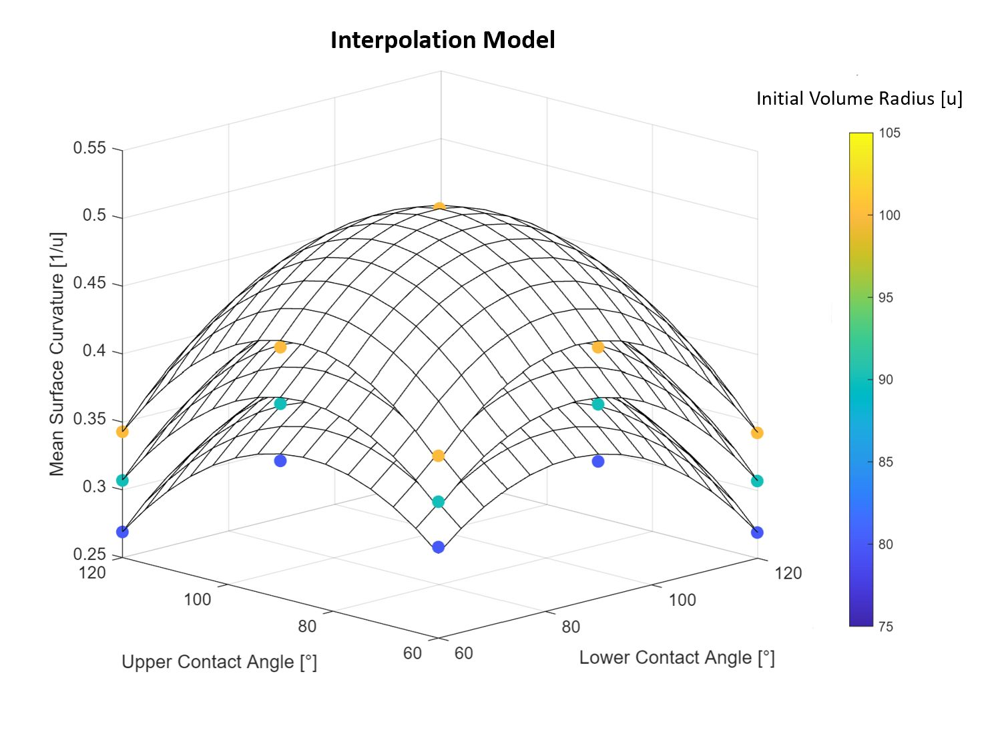

## Intro
For my thesis, I worked at the Institute for Applied Materials – Microstructure Modelling and Simulation at the Karlsruhe Institute of Technology. My research focused on the geometry of rotation-symmetric constant mean curvature surfaces, such as catenoids, unduloids, nodoids, spheres, and cylinders.  

The goal was to validate results produced by PACE3D (Parallel Algorithms for Crystal Evolution in 3D), a simulation software designed for phase transformation processes. This software solves the Allen-Cahn equation, which describe multiphase systems with wetting. One of the many applications, which caught my interest, was the design of water management systems using capillary forces.   

## Generating Reference Surfaces
While catenoids, spheres, and cylinders are straightforward to generate, unduloids and nodoids require a parametric representation. Based on the work of Mladenov and Hadzhilazova[^1], these shapes can be parametrized:  

<figure>
    
</figure>

## Results
The main task of my thesis was to conduct a parameter study using the simulation setup. I measured the constant mean curvature of the resulting surfaces and matched these with parametrized surfaces to identify the geometric shapes that were formed.  

From these results, I developed a response surface model to predict the mean curvature based on the simulation parameters. To test the model, I measured the error using samples that were not part of the original dataset.  

<figure>
    
</figure>

[^1]: Mladenov, Ivaïlo M. and Hadzhilazova, Mariana Ts. and Oprea, John (2007). [Unduloids and Their Geometry](https://www.emis.de/journals/AM/07-5/mladenov.pdf)

