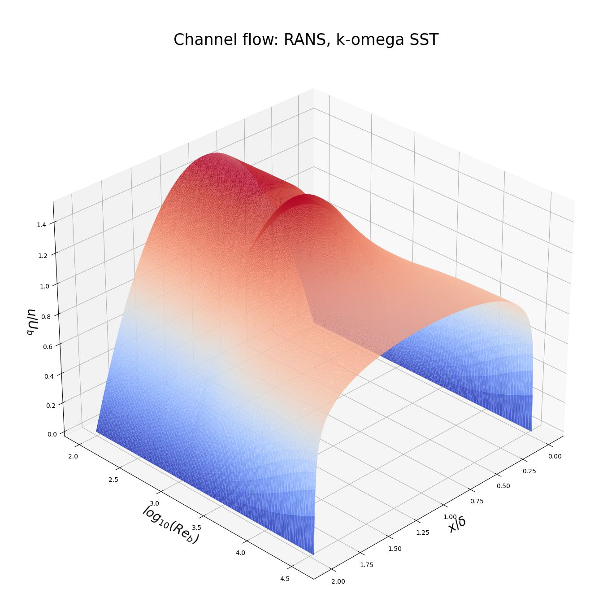
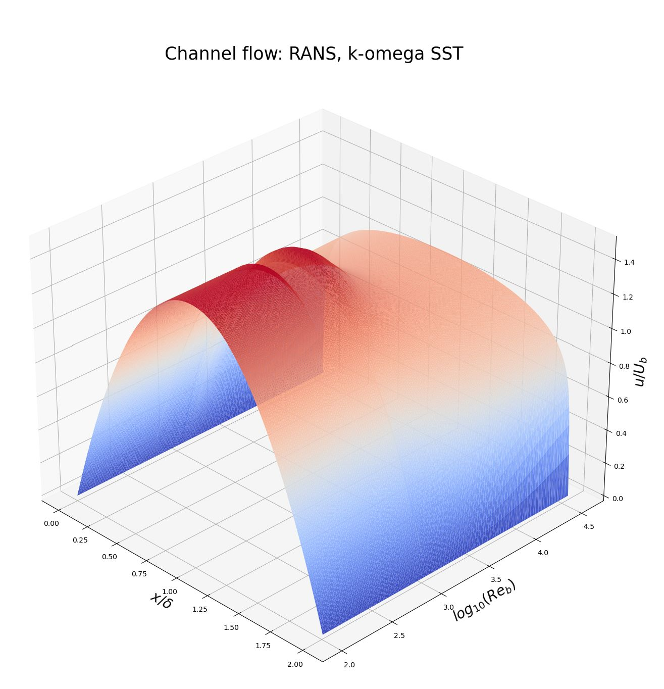
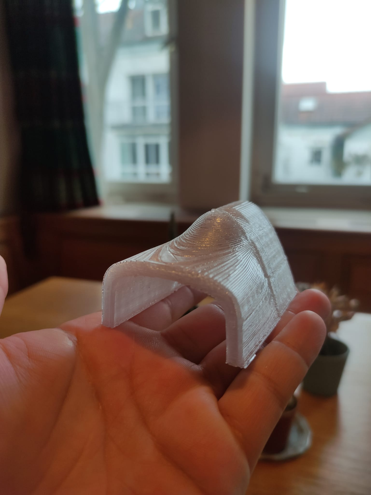

## Intro
Having a hard time to understand turbulence modelling, I had the idea of exploring how the Reynolds number in channel flow $Re_b=\frac{2\delta U_b}{\nu}$ affects the velocity profile $u(y) \; \forall y \in[0,2\delta]$. So I decided to reuse previous simulation setups for OpenFOAM and explore this further.  

## Parameters
The parameter study consisted on a exponentially sampled Reynolds numbers usng $b = 100 \cdot 2^a$. For each sample value, a simulation was carried out with cyclic boundary conditions for the inlet/outlet and leveraging symmetry to only solve for the lower part of the channel. A momentum source was added to drive the bulk velocity to the target value.   
- Solver: OpenFOAM 7 simpleFoam
- Grid: $4\times50\times1$
- Turbulence model: k-omega-SST
- Bulk velocity $U_b=1$
- Channel length $2\delta = 2$
- Reynolds number $Re \in [100, 36000]$
- Viscosity $\nu = \frac{2 \delta U_b}{Re_b}$

## Results
The plot uses:  
- First axis: Bulk Reynolds number in log scale $log_{10}(Re_b)$
- Second axis: Distance to lower wall $\frac{x}{\delta}$
- Third axis: Dimensionless velocity $\frac{u}{U_b}$
<figure>
    
</figure>
<figure>
    
</figure>

Each slice of the first axis corresponds to a velocity profile of a Reynolds number. At around $Re_b=2100$, the simulation did not converge within the allocated time steps. This can also be seen in the plot.  

As an extra task, I decided to print the plot. The file can be found [here](https://github.com/DanielMezaZ/turbulence_visualized/blob/main/Data/Processed/iLoveCFD_plane.stl).
<figure>
    
</figure>
