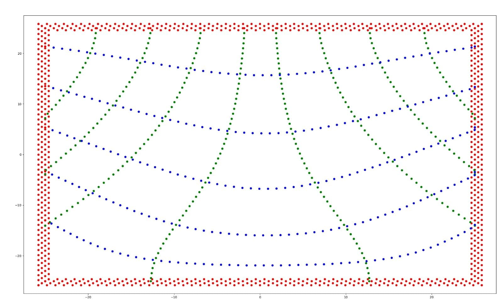

## Intro
Inspired by the lecture of Computational Material Modelling, I attempted to build a beam that follows the principal stress directions of a pre-defined field.  

The approach I had is basically wrong, as I considered the stress field of a solid beam. Yet, the beam I built is not solid. Nevertheless, all intersections between paths are of 90 degrees (other than with the domain boundary). Therefore, not shear forces are expected to be present in the beam inner paths.  

The main goal in this personal project was actually building something. So I took the path coordinates of the beam and generated gcode to print them with an FDM in my house.  

## Method
The approach was also quite simplistic. Having a stress field, I would compute the principal directions of the stress tensor. 
<figure>
    
</figure>
Then, I would select a set of starting points to generate paths. On those starting points, I would apply a forward Euler scheme (no fancy RK this time) to march in the field domain. Once leaving the domain, the path generation process would terminate.  
<figure>
    
</figure>

In the final stage, I would take the discrete set of points in their generation order and generate instructions for my printer to fabricate the beam. In addition to the generated paths, I also added a boundary to the beam.  
<figure>
    
</figure>

## Results
Despite the very limiting method, the carrying capacity of the beam was surprisingly good. In a test sample of 5mm width, I put as many books as I had in the living room on top.  

<figure>
    
</figure>
<figure>
    
</figure>
The beam never broke. Instead, the books kept toppling over, and at one point, even knocked over a nearby plant. Satisfied with the outcome, I decided to stop the testing (before any more plants met their demise).