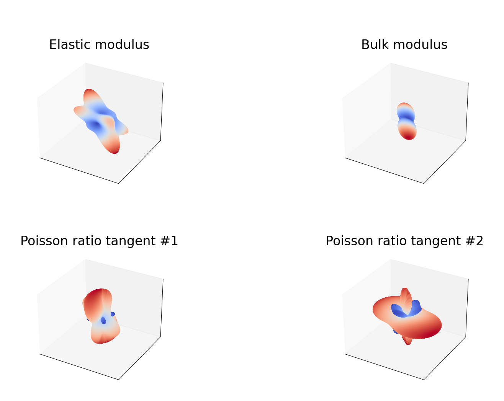
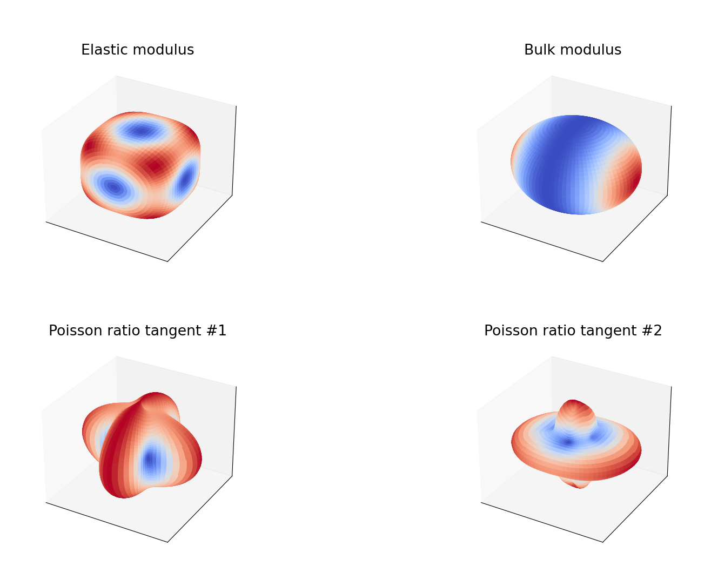
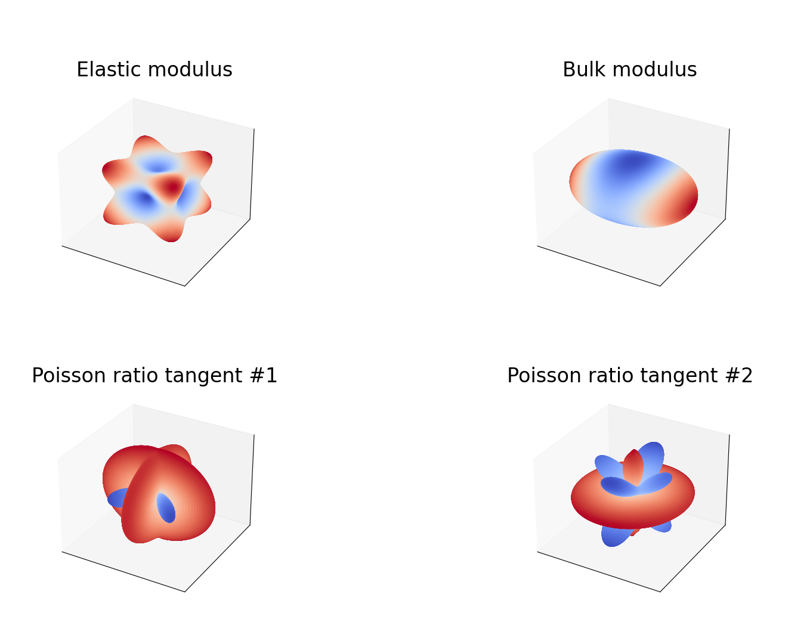
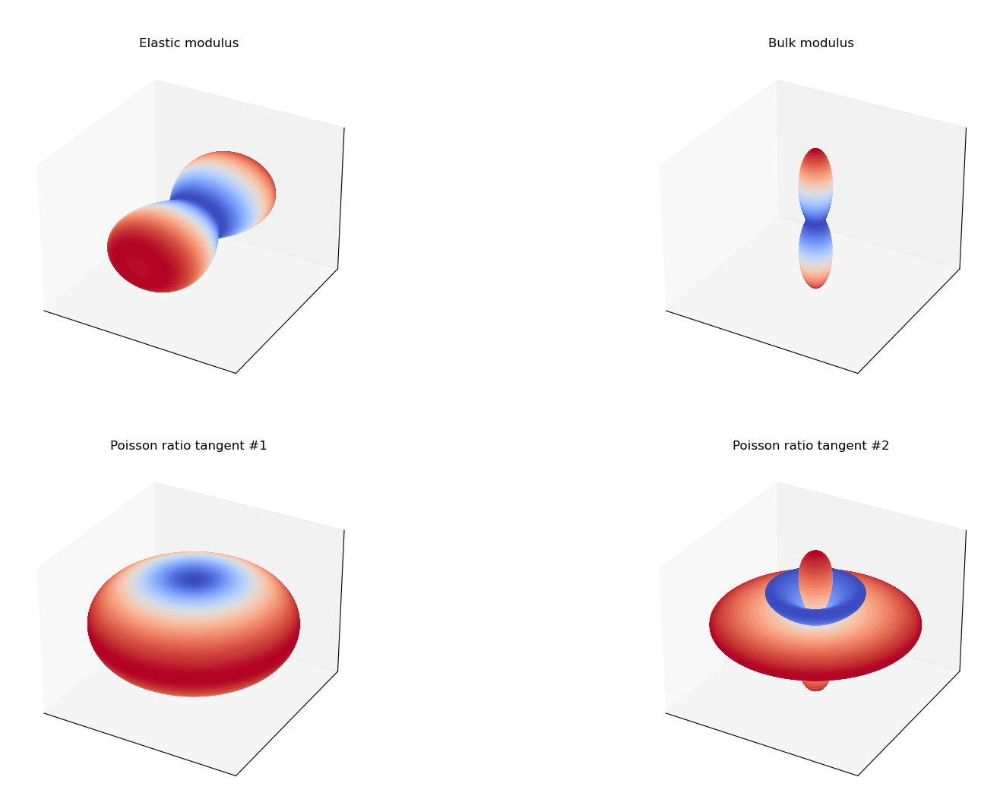
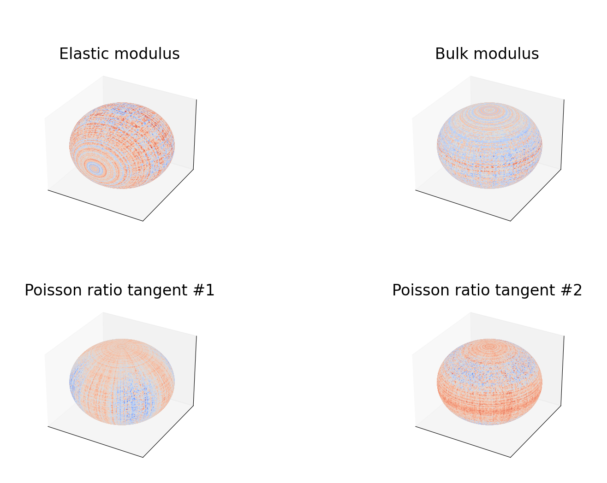

## Intro
Reflecting on my time in Karlsruhe, I recalled looking 3D plots of the stiffness tensor. This inspired me to explore how these plots are generated by creating a visualization tool myself.

The key theoretical background can be found in Böhlke and Brüggemann (2001) [^1].

# Theory

The stiffness tensor plays a key role in elastic constitutive laws, such as Hooke’s law. In continuum mechanics, it maps the stress tensor $\sigma_{ij} \in \mathbb{R}^{3,3}$ to the strain tensor $\epsilon_{kl} \in \mathbb{R}^{3,3}$. In other words, $\mathbf{C}:\mathbb{R}^{3,3} \rightarrow \mathbb{R}^{3,3}$:
$$\epsilon_{kl}=C_{klij}\sigma_{ij}$$

Since it's a 4th order tensor in 3D, the stiffness tensor originally has 81 components. However, due to symmetries, the number of independent components is reduced to 21:  
- The strain tensor is symmetric because it excludes rigid body motion $C_{klij}=C_{lkij}$
- The stress tensor is symmetric due to conservation of angular momentum $C_{klij}=C_{klji}$
- The stiffness tensor itself is symmetric because of how hyperelastic energy is formulated $C_{klij}=C_{ijkl}$

After accounting for these symmetries, only the material-specific symmetries remain.  

The inverse relationship, mapping strain to stress, uses the compliance tensor $\mathbb{S}=\mathbb{C}^{-1}$. This form will be important in the formulation below.

Böhlke, Brüggemann (2001) [^1] present direction-dependent expressions for several scalar moduli, including Young's modulus $E(\mathbf{d})$, bulk modulus $K(\mathbf{d})$, shear modulus $G(\mathbf{d},\mathbf{n})$, and the Poisson ratio $\nu(\mathbf{d},\mathbf{n})$:

### Young's Modulus
$$\frac{1}{E(\mathbf{d})} = \mathbf{d} \; \otimes \mathbf{d} \; \cdot \mathbb{S}[\mathbf{d} \; \otimes \mathbf{d}]$$

### Bulk Modulus
$$\frac{1}{3K(\mathbf{d})} = \mathbf{I} \; \cdot \mathbb{S}[\mathbf{d} \; \otimes \mathbf{d}]$$

The remaining material parameters depend on more than one direction. Therefore, visualizing them requires a fixing one of the two arguments directions to a constant value.

## Results
Directions $\mathbf{d}(\phi,\psi)$ are sampled through a mesh in spherical coordinates. Then, the material modulus is evaluated and used as a radius in the spherical coordinate, reslting in s set of coordinates $\{r, \phi,\psi\}$ for each sampled direction.  

### Anisotropic
<figure>
    
</figure>

### Orthotropic
<figure>
    
</figure>
<figure>
    
</figure>

### Transverse Isotropic
<figure>
    
</figure>

### Isotropic
<figure>
    
</figure>

[^1]: Böhlke, Brüggemann (2001). [Graphical representation of the generalized Hooke's law](https://www.researchgate.net/publication/39743282_Graphical_representation_of_the_generalized_Hooke's_law)