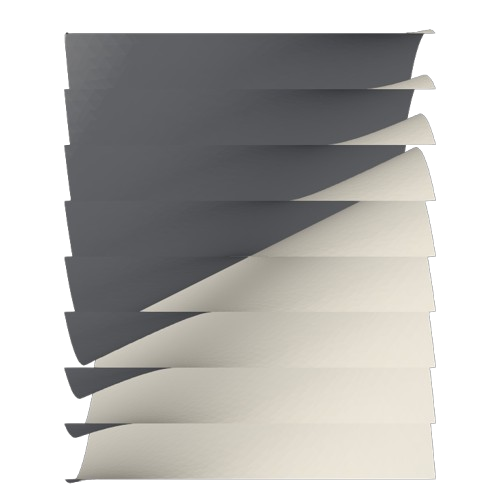
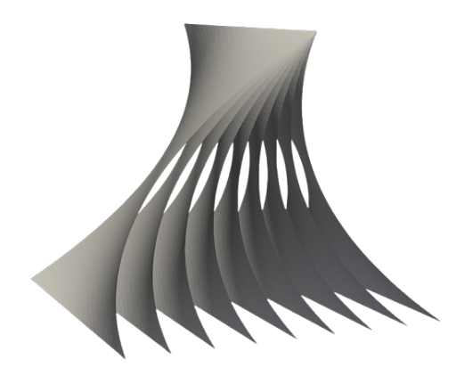
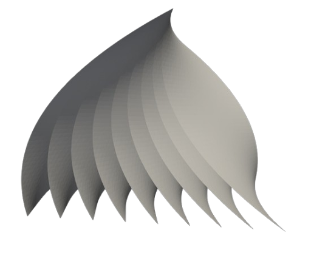

## Intro
The Navier-Stokes equations describe how fluids move. They take into account various factors like viscosity and pressure. However, when we simplify these equations under certain assumptions, we can derive a specific flow called Couette-Poiseuille flow.  

Combining the analytic solutions to Couette-Poiseuille with varying boundary conditions, a sculpture was made.

## Couette Poiseuille
We want to simulate a flow field in two dimensions. There is a fixed plate in the bottom and a moving plate on the upper part with velocity $u_0$. On the sides of the flow, cyclic boundary conditions are assumed. Assuming that the flow is:
- Steady $\frac{\partial u_i}{\partial t} = 0_i$
- Incompressible $\frac{\partial u_i}{\partial x_i} = 0$
- Only the $u_1$ component exists
- $u_1$ only depends on $y \in [0,L]$

Navier Stokes equation reduces to Couette-Poiseuille:  
$$\frac{d^2 u}{dy^2}=-\frac{1}{\mu}\frac{dp}{dx}=P$$

Using:
- $u(0)=0$
- $u(L)=u_0$  

Results in a quadratic solution:  
$$u(y)=\frac{u_0}{L} y + \frac{P}{2}\left(y^2-yL\right)$$

## Results
A more intuitive way to understand the velocity profile is to say that it depends on both the pressure gradient and the velocity of the moving plate. The velocity boundary conditions at the plates must be satisfied, which means that the fluid's velocity must match the plate's velocity at the boundaries.  

The pressure gradient influences the overall flow of the fluid, but it does not alter the boundary conditions at the plates. In other words, while the pressure gradient affects how the fluid moves, it doesn't change the requirement that the fluid velocity must equal the plate velocity at the surfaces.  

<figure>
    
</figure>
<figure>
    
</figure>
<figure>
    
</figure>

The file can be found [here](https://github.com/DanielMezaZ/couette_poiseuille_sculpture/blob/main/sculptureFixedVolume.stl)