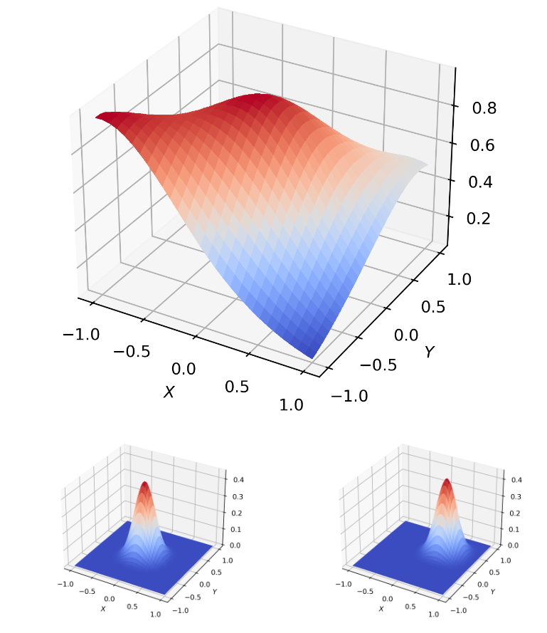
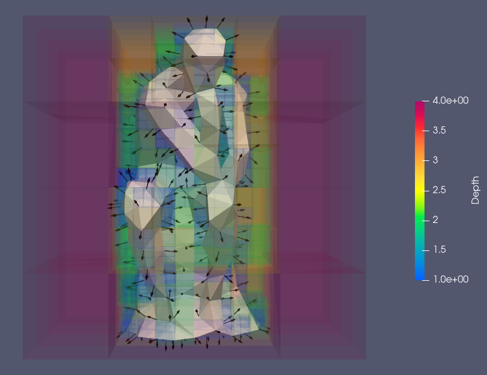
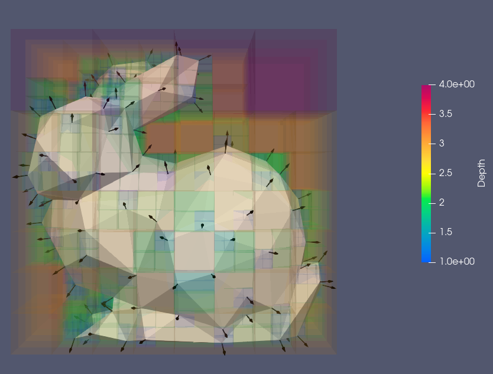
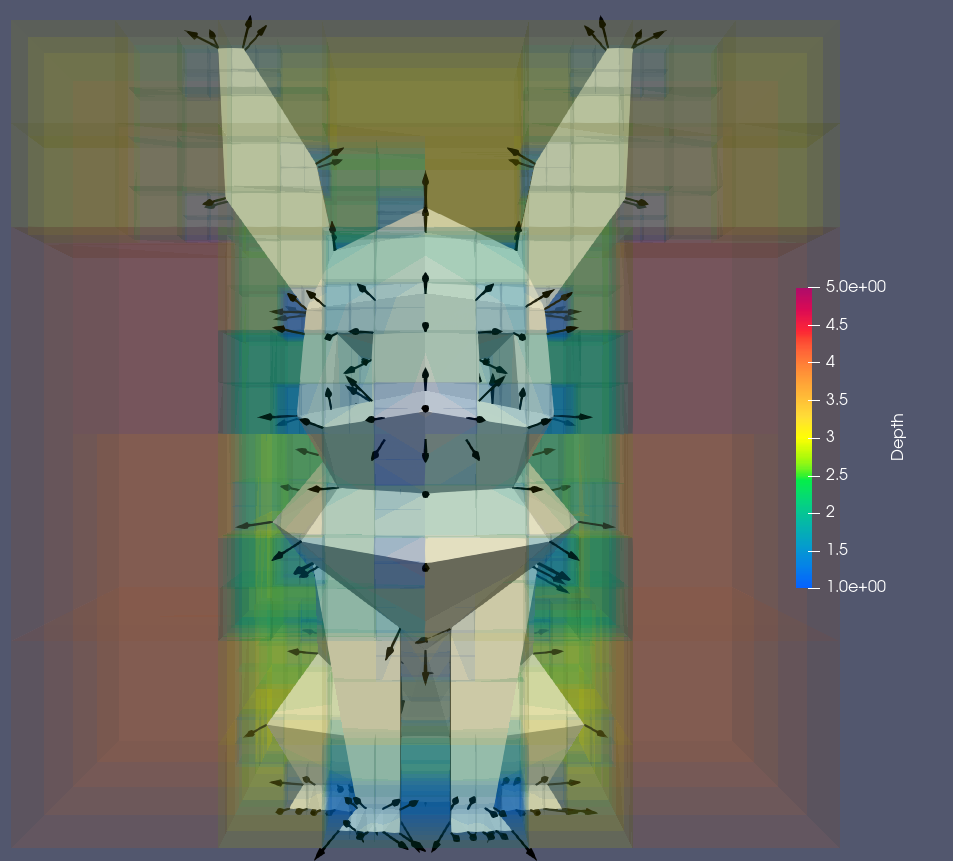
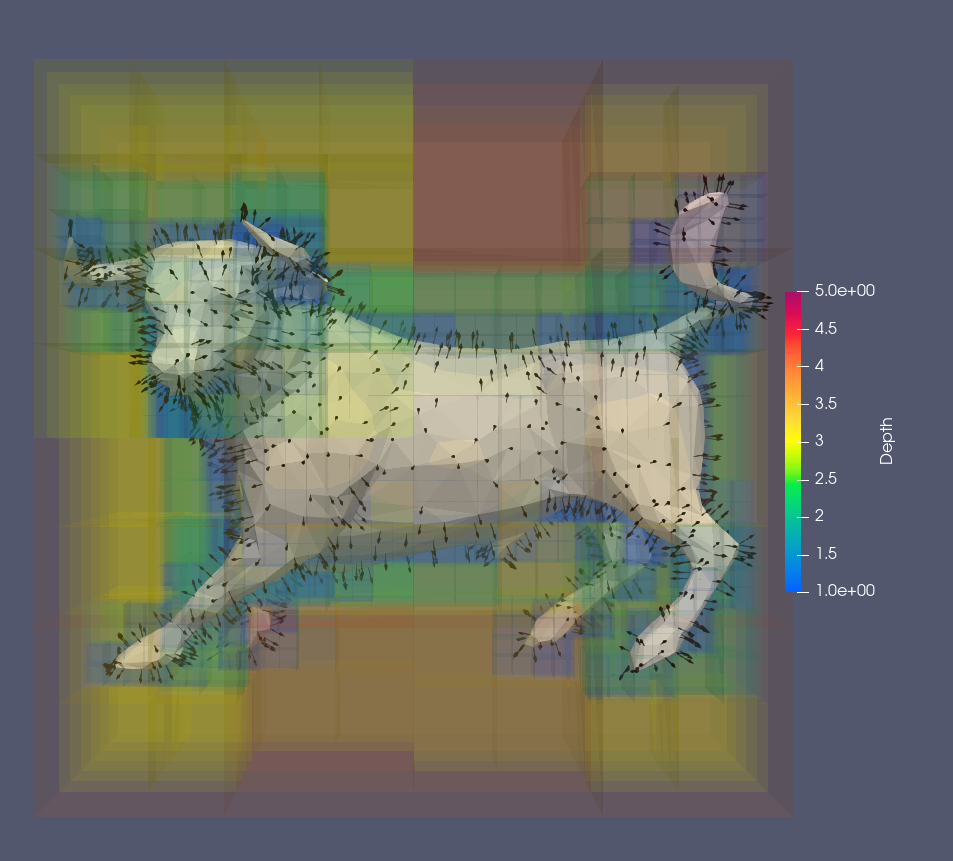
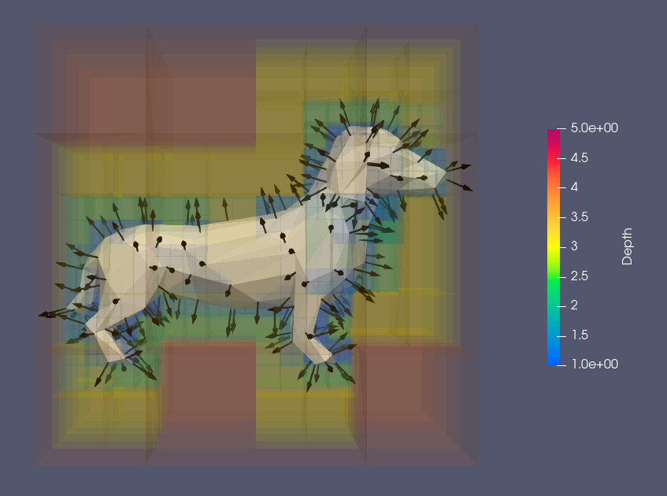
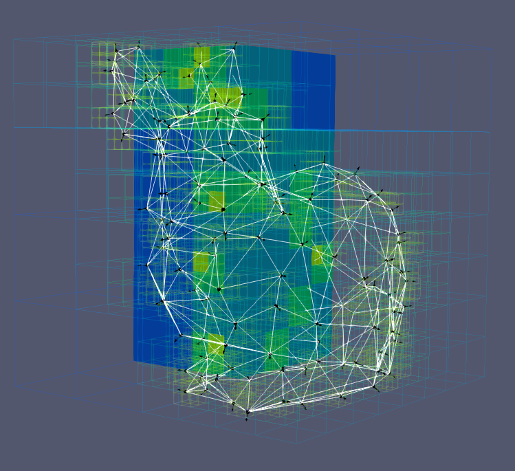

## My Failed Attempt
At one point, I came across the Poisson Surface Reconstruction[^1] paper. Since I had been working with the Laplace equation, I was intrigued by how a geometry reconstruction process could be framed as a Poisson problem. Furthermore, voxel structures seemed to be an interesting format to represent surfaces.  

I decided to give it a try and implement my own version of Poisson Surface Reconstruction. I knew it would be challenging and that my results might not be very high-performing, but my main goal was to learn throughout the process.

Although I never managed to get the solver to work (likely due to my approach in implementing basis functions in voxels) I still made significant progress. I successfully created an oriented point cloud from an input triangular mesh and built a voxel structure of predetermined depth based on that oriented point cloud.  

I still plan to revisit this project. Now that I have a better understanding of splines and their basis functions, I believe I can tackle it more effectively.  

## Results
### Preliminary B-Spline Testing
Before inserting their implementation in the voxel problem, I tested my B-Spline patches by generating surfaces with them.  
<figure>
    
    <figcaption>Top: B-Spline Patch. Bottom: Two of the B-Spline basis functions </figcaption>
</figure>

### Voxels for Poisson Reconstruction
Many low-poly shapes and their output voxels.  
<figure>
    
</figure>
<figure>
    
</figure><figure>
    
</figure><figure>
    
</figure><figure>
    
</figure>
<figure>
    
</figure>

[^1]: Kazhdan, Bolitho, Hoppe (2006). [Poisson Surface Reconstruction](https://hhoppe.com/poissonrecon.pdf)