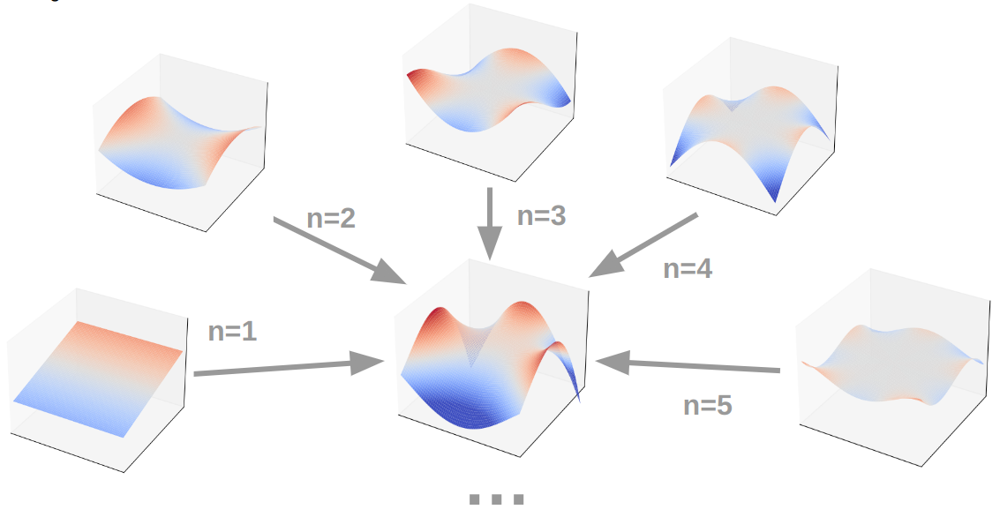
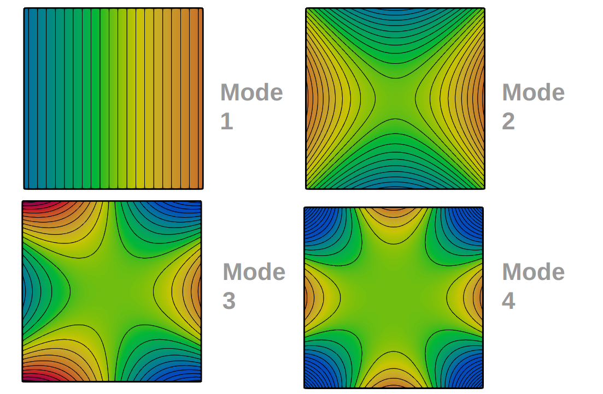
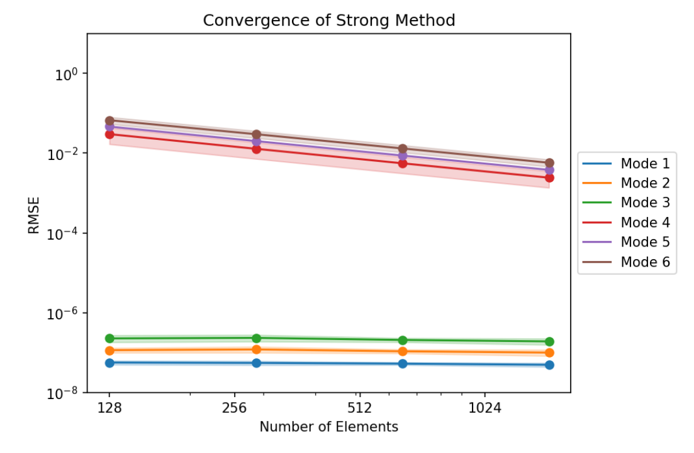
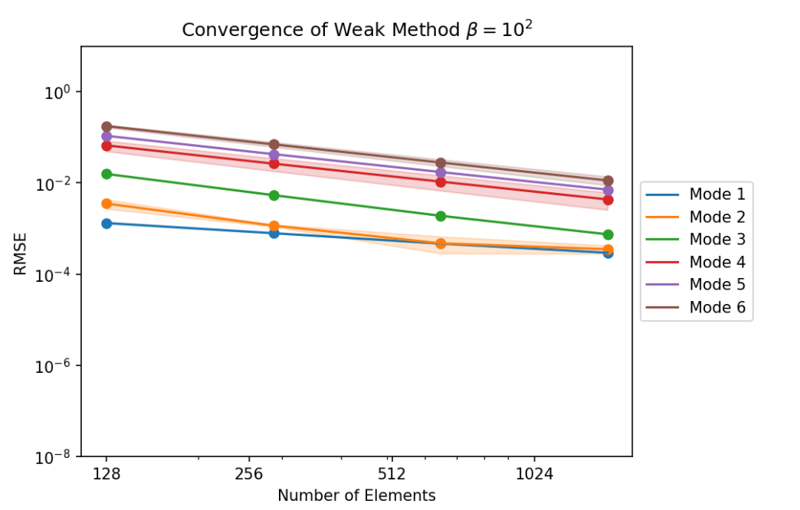
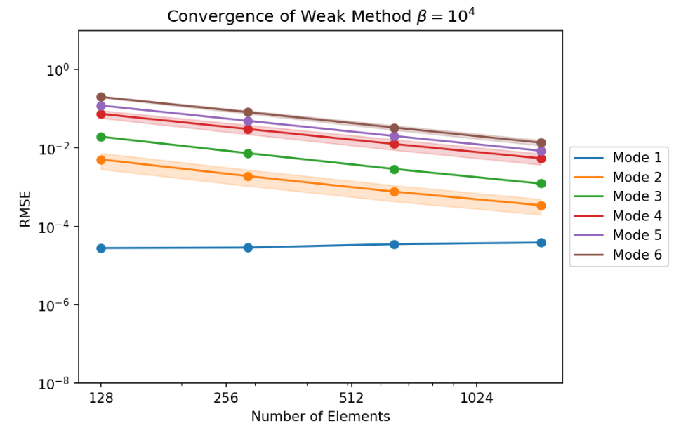
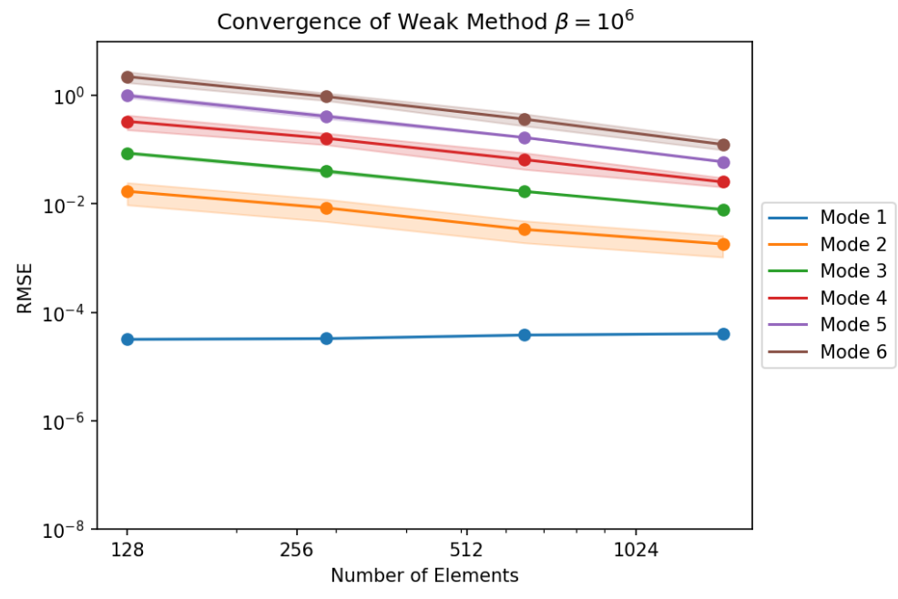
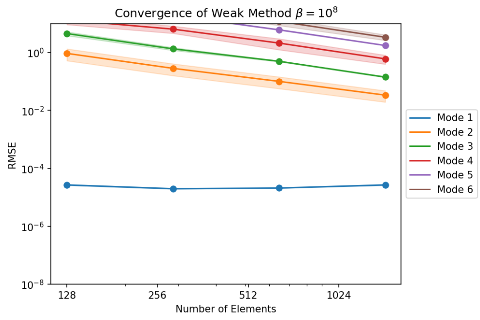

## Intro
During the initial stages of developing a Laplace solver, we found ourselves wondering how to verify the accuracy of our solution. Typically, we might have chosen a few benchmark cases with known analytical solutions (if available), or we could have compared our results to those from other solvers.  

Fortunately, Joseph Fourier's work in [Théorie analytique de la chaleur](https://gallica.bnf.fr/ark:/12148/bpt6k1045508v) (1822) provided a valuable resource. Instead of relying on just a few test cases or comparisons, we utilized Fourier Series, which offer an infinite, yet countable, set of functions that can serve as comprehensive benchmarks for our solver.  

**Note**: This post is closely related to the Isoparametric Toolpath Planning one. The last section shows the convergence plots of the toolpath planning solver.  

## Idea
The ideas of this section were based on the lecture by Moler, Strang in [^1]. Starting from a complex-function as Ansatz $\hat{f}:\mathbb{R}²\rightarrow\mathbb{C}$:  
$$\hat{f}_n(x,y)=(x+iy)^n \in \mathbb{C}$$  

It must be shown that the Ansatz function indeed solves the Laplace equation $\Delta f = 0$:  
$$\Delta \hat{f}_n(x,y)=\frac{\partial^2 \hat{f}_n(x,y)}{\partial x^2}+\frac{\partial^2 \hat{f}_n(x,y)}{\partial y^2}$$  
$$\Delta \hat{f}_n(x,y)=n(n-1)(x+iy)^{n-2}+i^2n(n-1)(x+iy)^{n-2}$$
$$=(1+i^2)n(n-1)(x+iy)^{n-2}=0$$  

It will later come in handy to transfer the complex equation to polar coordinates by changing the base from $x,y$ to $r,\phi$. This can be easily done with substitution:  
$$x+iy = r e^{i\phi} = r cos(\phi) + i sin(\phi)$$  

As $\hat{f}$ is a complex function, it has a real and imaginary part:  
$$\hat{f}_n(r,\phi)=r^ne^{i\phi n}=r^n cos(n\phi) +i r^n sin(n\phi)$$  
$$Re[\hat{f}_n(r,\phi)]=r^n cos(n\phi)$$  
$$Im[\hat{f}_n(r,\phi)] =r^n sin(n\phi)$$  

 Both of them represent valid solutions for the Laplace equation. Within this framework, two analytical solutions to the Laplace equation can be formulated for every number $n$. In this project, we limit our cases to $n\in\mathbb{Z}$; as those cases have an integer wavenumber in the angular dimension of the polar coordinate system. Having an integer wavenumber means that the domain for $\phi$ can be reduced to $[0,2\pi)$ with the functions preserving continuity.  

Nevertheless, not only the real and imaginary parts represent a valid solution for the Laplace equation. Indeed, any projection of the complex function is a solution to the PDE. The real solution is the projection to the real axis, and the imaginary solution the projection to the imaginary axis. The expression $e^{i\theta}$ is a normalized complex number that can be used to define a projection of the complex function by taking the real part of the complex function multiplied by the complex conjugate of the projection line. By following this framework, a generalized modal solution is obtained:  
$$f_{n,\theta}(r,\phi,\theta)=Re[\hat{f}_n e^{-i\theta}]=r^n cos(n\phi+\theta) \in\mathbb{R},\\\theta\in[0,2\pi)$$  

At this point, it is to be proven that only one phase shift is necessary for every mode of the solution. To achieve this goal, the following trigonometric properties will be needed (for compactness $c:cos, s:sin$ is used):  
$$c(n\phi+\theta_a)+c(n\phi+\theta_b)=c(n\phi)c(\theta_a)-s(n\phi)s(\theta_a)+c(n\phi)c(\theta_b)-s(n\phi)s(\theta_b)$$  
$$=c(n\phi)[c(\theta_a)+c(\theta_b)]-s(n\phi)[s(\theta_a)+s(\theta_b)]$$  

Because $\theta_a,\theta_b$ are constants, we can define the variables $C,\theta$ depending on them.  
$$C cos(\theta)=cos(\theta_a)+cos(\theta_b)$$  
$$C sin(\theta)=sin(\theta_a)+sin(\theta_b)$$  
$$C²=[cos(\theta_a)+cos(\theta_b)]²+[sin(\theta_a)+sin(\theta_b)]^2$$  
$$\theta=arctan\left(\frac{sin(\theta_a)+sin(\theta_b)}{cos(\theta_a)+cos(\theta_b)}\right)$$  

With this, we show that the sum of two trigonometric functions with phase shifts $\theta_a,\theta_b$ can be expressed as a scaling by a constant factor $C$ and a single phase shift $\theta$.  
$$cos(n\phi+\theta_a)+cos(n\phi+\theta_b)$$  
$$=C(cos(n\phi)cos(\theta)-sin(n\phi)sin(\theta))$$  
$$=Ccos(n\phi+\theta)$$  

The importance of this property is applying it to the generalized modal solution. Using this property shows that a sum of functions with the same mode $n$ can be reduced to a single function of mode $n$ with a scaling $C$ and phase shift $\theta$. Namely, only one projection of the solution and a phase shift are needed to capture an entire complex-valued solution (with a fixed wavenumber).  
$$f_{n,\theta_a}(r,\phi,\theta)+f_{n,\theta_b}(r,\phi,\theta)=Re[\hat{f}_n e^{i\theta_a}+\hat{f}_n e^{i\theta_b}]$$  
$$=r^n cos(n\phi+\theta_a) +r^n cos(n\phi+\theta_b) \\
f_{n,\theta_a}(r,\phi,\theta)+f_{n,\theta_b}(r,\phi,\theta)$$  
$$=C r^n cos(n\phi+\theta)$$  

Therefore, the mode with wavenumber $n$ is expressed as $f_n$:  
$$f_{n}(r,\phi)=r^n cos(n\phi+\theta_n)$$  

To reconstruct the function $f$, all the modes are added up with a constant weight $w_k$. Because the weight is a constant that scales the mode, the scaling constant $C$ of equation is omitted.  
$$f=\sum_{n=0}^\infty w_n f_n$$  

In this sense, $f$ represents a general form of a solution to the Laplace equation. The solution can be decomposed to the modes of wavenumber k. Each mode k also has the property of being expressed as a binomial function in the coordinates $x,y$.  

For the validation of our Laplace solver, the first $n$ modes of the general solution will be used as benchmark to measure the accuracy of the solver. Furthermore, the phase shift of the mode $\theta_k$ is left as a degree of freedom (DOF). To assess the effect of mesh orientation dependencies on the result, each mode function will be solved in a finite set of values for $\theta_k$.  

## Results
### Modal functions
As additional information, the trigonometric functions with integer wavenumbers are also orthogonal to each other. Therefore, they build a base. As this is already going beyond the initial scope, we omit the proof here. Nevertheless, this means that an arbitrary function may be expressed in terms of the modal solutions:  
<figure>
    
</figure>
<figure>
    
</figure>

### Validation of Solver
Having an analytical solution, we were able to validate our Laplace solver through a convergence study, where we show the effect of mesh refinement in the sum of squared errors at the vertex values of the solution function. For each mode $n$, we use 6 phase shifts with $\theta \in [0,\pi/n]$ to assess for mesh orientation dependencies. This effect is shown in the thickness of the value bands as a $3\sigma$ confidence interval.  

- Strong BC method:  
<figure>
    
</figure>
- Weak BC method:  
<figure>
    
</figure>
<figure>
    
</figure>
<figure>
    
</figure>
<figure>
    
</figure>

[^1]: Moler, Strang (2015). [Learn Differential Equations: Up Close With Gilbert Strang and Cleve Moler](https://ocw.mit.edu/courses/res-18-009-learn-differential-equations-up-close-with-gilbert-strang-and-cleve-moler-fall-2015/)