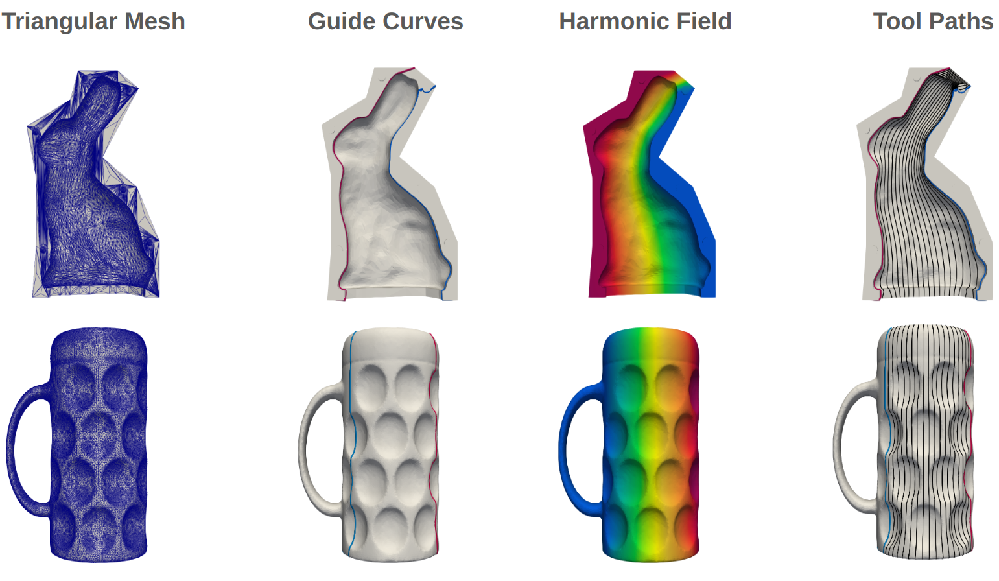

## Intro
Over the course of two semesters, I worked in a group project together with Holdee Pang and Lufan Zuo and with the supervision of Dr. Tino Bog and Dr. Christoph Ertl. In this project, we explored the use of harmonic functions for path planning in milling. More specifically, our focus was the development of an interactive method where a user had the opportunity of influencing the path planning process.  

## Method
### Guide Curves
The method employs two guide curves provided by an user. After preparation of the guide curves through smoothening for example, the guide curves are projected onto a triangulated surface. Once on the surface, a transition from global coordinates to barycentric coordiantes takes place.  

### Laplace Solver
A subdomain of the surface is selected to only consider the relevant faces. On the subdomain, a Laplace solver is used to inform the problem about the surface shape. The Laplace solver employs a weak formulation to enable the usage of the finite element method:  
$$\frac{\partial^2 \phi}{\partial x_i^2} = 0 \quad \rightarrow \quad \int_{\Omega} \frac{\partial \phi}{\partial x_i} \frac{\partial \phi}{\partial x_i} dx = 0 \quad , \quad x_j \in \Omega$$

After discretization and quadrature, the following system results $K_{mn}\phi_n=0_m$:  
$$\sum_e \sum_{GP} w_{GP} \{\det_{ij}[J_{ij}] \phi_m B_{km} B_{kn} \phi_n \}_{GP} = \phi_m K_{mn} \phi_n$$
$$\sum_e \sum_{GP} w_{GP} \{\det_{ij}[J_{ij}]\phi_m N_m N_n 0_n \}_{GP} = 0$$

Because the surface is an embedding of $\mathbb{R}^2$ in $\mathbb{R}^3$, a singular value framework is required to compute Jacobian operations.

### Boundary Conditions
Having processed the user input guide curves and the surface, they need to be put together in the form of boundary conditions. One guide curve will be assigned a value of $-1$ and the other guide curve a value of $+1$:  
$$\hat{\phi}=-1 \; , \; x_j \in \Gamma_A$$  
$$\hat{\phi}=+1 \; , \; x_j \in \Gamma_B$$  

One important consideration is that the user's guide curves shall not need to coincide with the vertices of the mesh. For this reason, we exmploy the computed barycentric coordinates of the guide curves to apply boundary conditions in a weak formulation:  
 $$\phi=\hat\phi \quad \rightarrow \quad \int_{\Gamma} \phi \phi \,dx = \int_{\Gamma} \phi \hat\phi \,dx  \quad , \quad  x_j \in \Gamma$$  

 Analogous to the discretization and integration process from the Laplace solver, the previous formulation becomes a linear system $M_{mn}\phi_n = F_m$:  
$$\sum_l \sum_{GP} w_{GP} \{\det_{ij}[J_{ij}]\phi_m N_m N_n \phi_n\}_{GP} = \sum_l \sum_{GP} w_{GP} \{\det_{ij}[J_{ij}]\phi_m N_m \hat{\phi}\}_{GP}$$  

**Note**: One key difference in this integration step is that the quadrature points are defined on the guide curve, but the shape functions must be evaluated in the parametric coordinates of the triangle elements.  

To combine the linear systems, a penalty approach is used with the factor $\beta$:
$$(K_{mn}+\beta M_{mn})\phi_n=\beta F_m$$

## Results
<figure>
    
</figure>